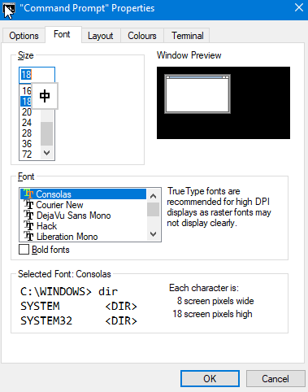
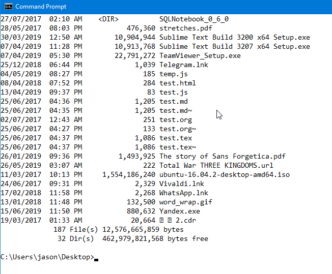

## cmd 和 Powershell

Windows 一向不是對命令行友好的系統, cmd 和 Powershell 都不好用, 而且對非英語系支持極差。cmd 和 Powershell 的 UI 都是共用 windows console, 它會根據當地的地區 code page 顥示字體, 由程式調用 Windows Console 的 API 決定顥示效果, 而且當中的 source code 已經有 [三十年歷史](https://www.youtube.com/watch?v=KMudkRcwjCw), 想改變 UI 體驗比較困難。

非英語系支持極差:

1. 當設定 codepage 為 latin
2. 字體只能選 consolas

顥示中文會亂碼

## Windows Terminal

替代方向有 [cmder](https://blog.miniasp.com/post/2015/09/27/Useful-tool-Cmder), 但始終不是官方方案, 有見及此, Windows 10 1903 版本推出 Windows Termianl, 終於能在 cmd 顥示中文了, 連字體都好看不少。Preview 版本可以[在此下載](https://www.microsoft.com/en-us/p/windows-terminal-preview/9n0dx20hk701?activetab=pivot:overviewtab)。

cmd 的樣子:

在 Ubuntu 下用 vim:

Powershell 的樣子:

